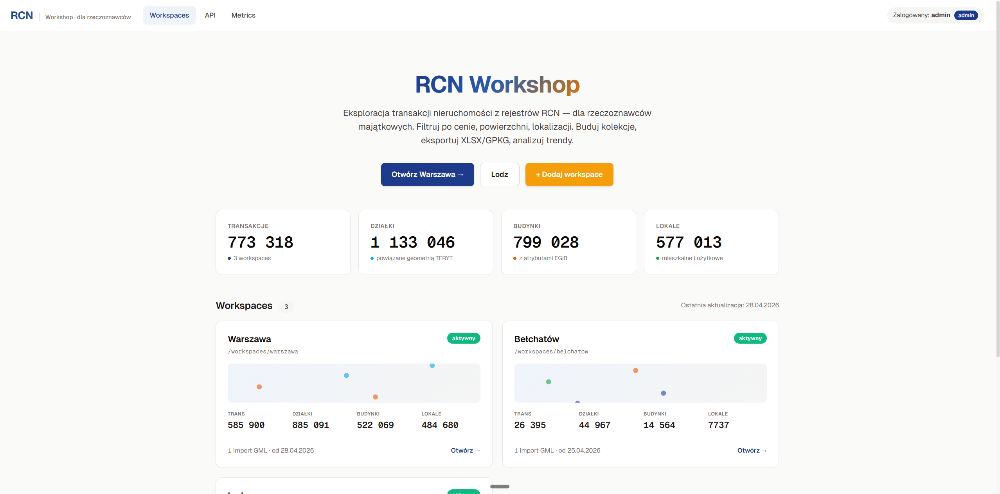

# RCN Workshop

Self-hosted narzędzie dla **rzeczoznawców majątkowych** do pracy z plikami GML
**Rejestru Cen Nieruchomości (RCN)**: import, łączenie, filtrowanie (atrybutowe
i przestrzenne), mapa, analiza statystyczna i eksport transakcji.

> **EN:** RCN Workshop is a self-hosted web tool for Polish property appraisers
> working with GML exports from the Polish Real Estate Price Register (RCN):
> import, merge, filter, map, analyse and export transactions. The project,
> its UI and documentation are in Polish.



## Funkcje

- **Import GML** z Geoportalu / ośrodków dokumentacji geodezyjnej (snapshot lub
  przyrostowy), łączenie wielu plików w workspace z upsertem po `gml_id`
  (nowszy wygrywa, tryb snapshot-safe nie gubi notatek).
- **Tabela + filtry**: typ transakcji, rynek, cena, data, TERYT, miejscowość,
  filtry per-kolumna, wiki-linki (klik w ident działki/budynku/lokalu → wszystkie
  transakcje obiektu).
- **Mapa (Leaflet)**: punkty transakcji, obrysy działek/budynków z warstw GPKG,
  filtr wielokątem/bbox, sąsiedzi w zadanym promieniu (dokładna geodezja
  `pyproj.Geod`), miarka odległości, warstwa POI (OpenStreetMap).
- **Koszyk + analiza**: statystyki cenowe per typ nieruchomości, trend, scatter
  cena/m² vs data.
- **System wtyczek**: własne analizy w Pythonie (stdlib-only) wgrywane z UI
  i uruchamiane na koszyku transakcji.
- **Eksporty**: XLSX, GPKG, CSV.
- **Flagi jakości danych**: multi-akt, brak obiektów, ekstremalne ceny/m² itd.
- **Role**: admin + opcjonalny użytkownik readonly (odczyt/eksport/analiza).
- Działa **offline** po instalacji (bez CDN dla krytycznych bibliotek mapy/wykresów).

## Szybki start

### Windows (lokalnie, jeden komputer)

Wymagany jedynie [uv](https://docs.astral.sh/uv/) (launcher sam pobierze Pythona 3.12):

```bat
packaging\windows\start-windows-desktop.bat   :: natywne okno (WebView2)
packaging\windows\start-windows-uv.bat        :: wariant przeglądarkowy
```

Tryb lokalny działa na `127.0.0.1` bez logowania. Dostępny jest też portable
`.exe` i instalator (`packaging/windows/`, PyInstaller + Inno Setup). Instrukcja
krok po kroku: [`docs/QUICKSTART_Windows.md`](docs/QUICKSTART_Windows.md).

### Serwer (Docker)

```bash
git clone https://github.com/emer-MR/rcn-workshop && cd rcn-workshop
cp .env.example .env    # KONIECZNIE ustaw RCN_AUTH_PASSWORD (fail-fast na 'change-me')
docker compose up -d --build
# aplikacja: http://127.0.0.1:8000
```

> ⚠️ **Hosting publiczny wyłącznie za reverse-proxy z TLS.** Aplikacja używa
> HTTP Basic Auth — bez HTTPS hasło idzie otwartym tekstem, a bez rate-limitu
> łatwiej o brute-force. Domyślny `docker-compose.yml` binduje dlatego tylko
> `127.0.0.1`. Gotowy przykład produkcyjny z Traefikiem (TLS + HSTS +
> rate-limit): [`docs/docker-compose.traefik.example.yml`](docs/docker-compose.traefik.example.yml).

## Dane

- Workspace = **folder z kompletem danych** (`data/workspaces/<nazwa>/`): baza
  `*.sqlite`, opcjonalne warstwy GPKG (auto-wykrywane), opcjonalny plik POI
  `*.poi.sqlite`, notatki w osobnym pliku. Folder można w całości przekazać
  innej osobie — patrz [`docs/QUICKSTART_wymiana-powiatow.md`](docs/QUICKSTART_wymiana-powiatow.md).
- **Aplikacja nie zawiera żadnych danych RCN.** Dane z Rejestru Cen Nieruchomości
  pozyskujesz samodzielnie (wniosek do właściwego ośrodka / Geoportal) i
  odpowiadasz za zgodność ich wykorzystania z licencją ośrodka.
- Dane POI pochodzą z **OpenStreetMap** (© autorzy OpenStreetMap, licencja
  [ODbL](https://www.openstreetmap.org/copyright)).

## Architektura

FastAPI (Python 3.12) + SQLite (zapytania przestrzenne czystym Pythonem:
shapely + `pyproj.Geod` — bez SpatiaLite) · Jinja2 + Alpine.js + Leaflet +
Chart.js · Docker lub natywnie na Windows (jedna ścieżka kodu).

Wzbogacanie danych (geometrie EGIB, geokodowanie, generowanie paczek POI)
odbywa się osobnym, nieupublicznionym toolchainem producenta — aplikacja
konsumencka wykrywa jego brak (`rcn_core/producer.py`) i po prostu nie pokazuje
tych funkcji. Import GML, mapa, filtry, analiza i eksporty są w pełni dostępne
w wersji publicznej.

## Rozwój

```bash
uv sync --extra dev
uv run pytest          # pełna suita (część testów wymaga lokalnych fixture GML -> skip)
uv run ruff check .
```

Zasady kontrybucji (w tym CLA): [`CONTRIBUTING.md`](CONTRIBUTING.md).
Projekt, kod, commity i dokumentacja są **po polsku** (dziedzina: polska
geodezja i wycena nieruchomości).

## Licencja

[GNU AGPL-3.0](LICENSE). Przy udostępnianiu aplikacji przez sieć masz obowiązek
udostępnić użytkownikom kod źródłowy (link „Kod źródłowy" w stopce aplikacji,
konfigurowalny przez `RCN_SOURCE_URL`). Zapytania o licencję komercyjną
(dual-licensing) — przez Issues.
